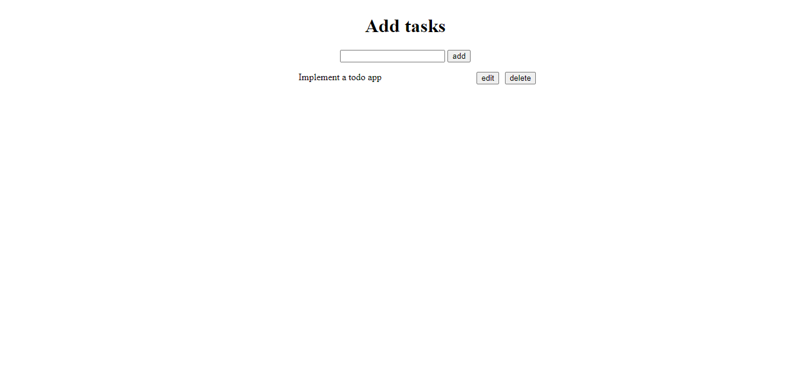

# simple-todo-app

### After you cloned the repo, you can run the page by navigating to the index.html file.

### Here is a screenshot

#### You can see the page live by using the below link

[simple-todo-app](https://biniyamnegasa.github.io/simple-todo-app/)